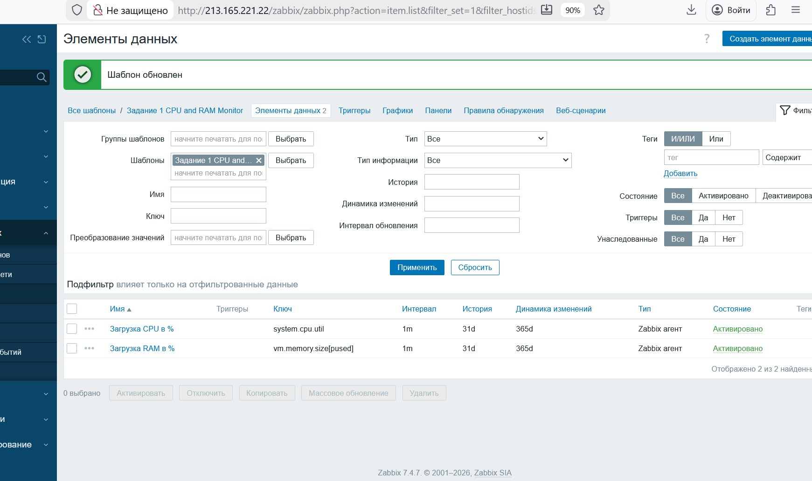
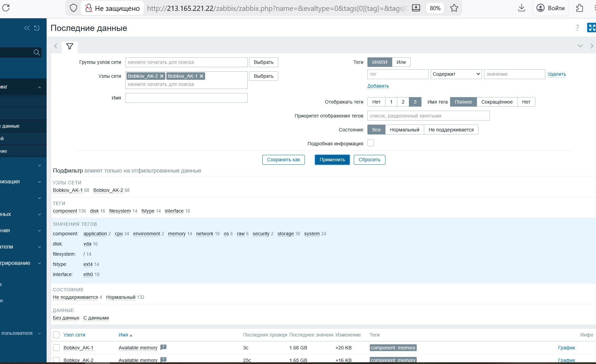
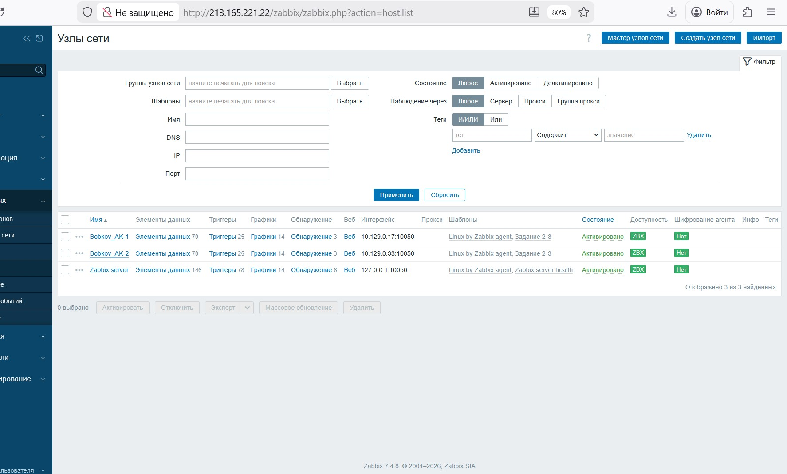
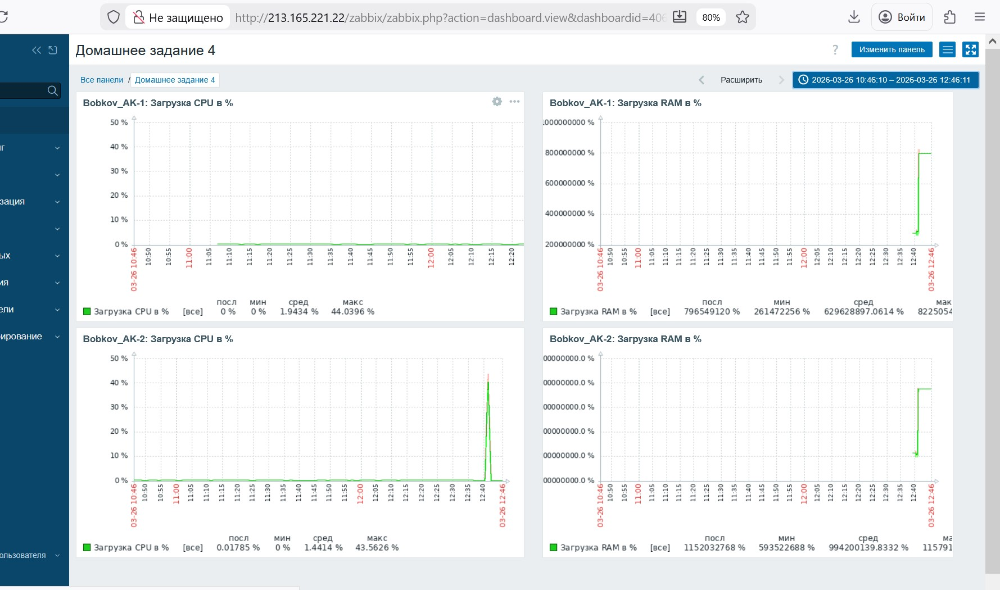
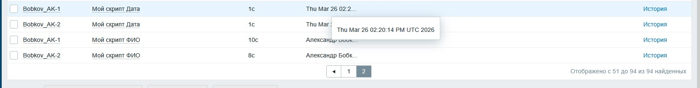

# Домашнее задание к занятию "Система мониторинга Zabbix часть 2" - Бобков Александр

## Задание 1
Создайте свой шаблон, в котором будут элементы данных, мониторящие загрузку CPU и RAM хоста.

### Процесс выполнения
1. Выполняя ДЗ сверяйтесь с процессом отражённым в записи лекции.
2. В веб-интерфейсе Zabbix Servera в разделе Templates создайте новый шаблон.
3. Создайте Item который будет собирать информацию об загрузке CPU в процентах.
4. Создайте Item который будет собирать информацию об загрузке RAM в процентах.
### Требования к результатам
* Прикрепите в файл README.md скриншот страницы шаблона с названием «Задание 1».

## ОТВЕТ:

### Выполненные шаги:
1. В разделе **Сбор данных** -> **Шаблоны** создан новый шаблон «CPU and RAM Monitor».
* ** в графе "Видимое имя делаем" ->  «Задание 1 CPU and RAM Monitor».
2. Добавлен элемент данных (Item) для сбора загрузки **CPU** в процентах:
   - Ключ: `system.cpu.util`
   - Тип: Числовой (с плавающей точкой)
   - Единицы измерения: `%`
3. Добавлен элемент данных (Item) для сбора загрузки **RAM** в процентах:
   - Ключ: `vm.memory.size[pused]`
   - Тип: Числовой (с плавающей точкой)
   - Единицы измерения: `%`

<details>
<summary>Нажми, чтобы увидеть скриншот шаблона с названием «Задание 1 CPU and RAM Monitor» </summary>

</details>


# Задание 2

### Добавьте в Zabbix два хоста и задайте им имена <фамилия и инициалы-1> и <фамилия и инициалы-2>. Например: ivanovii-1 и ivanovii-2.

### Процесс выполнения

1. Выполняя ДЗ сверяйтесь с процессом отражённым в записи лекции.
2. Установите Zabbix Agent на 2 виртмашины, одной из них может быть ваш Zabbix Server.
3. Добавьте Zabbix Server в список разрешенных серверов ваших Zabbix Agentов.
4. Добавьте Zabbix Agentов в раздел Configuration > Hosts вашего Zabbix Servera.
5. Прикрепите за каждым хостом шаблон Linux by Zabbix Agent.
6. Проверьте что в разделе Latest Data начали появляться данные с добавленных агентов.
### Требования к результатам

* Результат данного задания сдавайте вместе с заданием 3.

## ОТВЕТ:

* **В Zabbix добавлены два хоста для мониторинга:**
1. **Bobkov_AK-1** (Zabbix Server / Агент)
2. **Bobkov_AK-2** (Отдельный узел с Zabbix Agent)

### Процесс выполнения:
- На обеих машинах установлен и настроен `zabbix-agent`.
- В конфигурационном файле `/etc/zabbix/zabbix_agentd.conf` указан IP-адрес Zabbix-сервера в параметре `Server` и корректный `Hostname`.
- На стороне агентов в `iptables` открыт порт **10050** для входящих соединений от сервера.
- Хосты успешно добавлены в разделе **Сбор данных** -> **Узлы сети**.
- К обоим хостам привязан стандартный шаблон **Linux by Zabbix agent**.
- Статус доступности **ZBX** — активирован (зеленый).


**Текст использованных команд**

1. **Устанавливаем сам Агент:**

```bash
apt update && apt install zabbix-agent -y
```
2. **Правим конфигурационный файл:** `nano /etc/zabbix/zabbix_agentd.conf`

```ini
ServerActive=10.129.0.5 — IP сервера (куда агент сам шлет данные);
Hostname=zabbixclient — это имя должно точно совпадать с полем "Host name" в веб-интерфейсе Zabbix.
Server=10.129.0.5 — для пассивных проверок (чтобы сервер мог опрашивать агент).
```
3. **Произодим рестарт сервиса Агента:**

```bash
systemctl restart zabbix-agent
```

4. **Добавляем сервис в автозагрузку:**

```bash
systemctl enable zabbix-agent
```

<details>
<summary>Нажми, чтобы увидеть скриншот "Последние Данные" </summary>

</details>


# Задание 3

### Привяжите созданный шаблон к двум хостам. Также привяжите к обоим хостам шаблон Linux by Zabbix Agent. 

### Процесс выполнения

1. Выполняя ДЗ сверяйтесь с процессом отражённым в записи лекции.
2. Зайдите в настройки каждого хоста и в разделе Templates прикрепите к этому хосту ваш шаблон.
3. Так же к каждому хосту привяжите шаблон Linux by Zabbix Agent.
4. Проверьте что в раздел Latest Data начали поступать необходимые данные из вашего шаблона.
### Требования к результатам

* Прикрепите в файл README.md скриншот страницы хостов, где будут видны привязки шаблонов с названиями «Задание 2-3». Хосты должны иметь зелёный статус подключения

## ОТВЕТ:

Выполнена привязка шаблонов к созданным хостам (`Bobkov_AK-1` и `Bobkov_AK-2`). К каждому узлу одновременно подключены два шаблона:
1. **Linux by Zabbix agent** (стандартный).
2. **CPU and RAM Monitor** (из Задания 1).

### Возникла проблема:
При попытке одновременной привязки шаблона из Задания 1 возникла ошибка: **«Не удалось унаследовать элемент данных... так как элемент данных с таким же ключом уже унаследован...»**.

**Причина:** Ключи `system.cpu.util` и `vm.memory.size[pused]` уже зарезервированы в стандартном шаблоне `Linux by Zabbix agent`. Zabbix не позволяет иметь два одинаковых ключа на одном хосте.

**Решение:** 
В пользовательском шаблоне ключи были изменены на уникальные (добавлены дополнительные параметры):
- Для CPU: `system.cpu.util[all,avg1]`
- Для RAM: `vm.memory.size[pused,total]`
Это позволило успешно прилинковать оба шаблона одновременно.

### Результат настройки:
На странице «Узлы сети» оба хоста имеют статус **ZBX (зеленый)**, данные поступают из обоих источников.
<details>
<summary>Нажми, чтобы увидеть скриншот "Привязки шаблонов" </summary>

</details>

# Задание 4

### Создайте свой кастомный дашборд.

### Процесс выполнения
1. Выполняя ДЗ сверяйтесь с процессом отражённым в записи лекции.
2. В разделе Dashboards создайте новый дашборд.
3. Разместите на нём несколько графиков на ваше усмотрение.
### Требования к результатам

* Прикрепите в файл README.md скриншот дашборда с названием «Задание 4»

## ОТВЕТ:
Создана кастомная «Панель» (Dashboard) для визуализации данных с обоих серверов.

**Нагрузочное тестирование (Stress-test):**
Для проверки динамики графиков на агентах выполнены команды:
1. **Нагрузка CPU:** `timeout 60s cat /dev/urandom | gzip -9 > /dev/null`
2. **Нагрузка RAM:** `sudo mount -t tmpfs -o size=500M tmpfs /mnt && dd if=/dev/zero of=/mnt/testfile bs=1M count=500`

**Результат:**
На графиках зафиксированы скачки потребления ресурсов, что подтверждает корректность настройки.

<details>
<summary>Нажми, чтобы увидеть скриншот "Дашборда" </summary>

</details>


# Задание 6*

### Создайте UserParameter на bash и прикрепите его к созданному вами ранее шаблону. Он должен вызывать скрипт, который:

   * при получении 1 будет возвращать ваши ФИО,
   * при получении 2 будет возвращать текущую дату.


### Требования к результатам

* Прикрепите в файл README.md код скрипта, а также скриншот Latest data с результатом работы скрипта на bash, чтобы был виден результат работы скрипта при отправке в него 1 и 2

## ОТВЕТ:


* На стороне агента по пути `/usr/local/bin/zabbix_script.sh` создан исполняемый файл. Скрипт обрабатывает входящие аргументы для вывода ФИО или даты.

**Код скрипта:**
```bash
#!/bin/bash
if [ "$1" == "1" ]; then
    echo "Александр Бобков"
elif [ "$1" == "2" ]; then
    date
fi
```

* Чтобы агент разрешил серверу запрашивать данные через этот скрипт, необходимо прописать «пользовательский параметр».

*    Открываем конфиг: sudo nano /etc/zabbix/zabbix_agentd.conf
*    Добавляем строку в раздел UserParameter:
    UserParameter=custom.script[*],/usr/local/bin/zabbix_script.sh $1
* Логика:
     custom.script — уникальное имя ключа для Zabbix.
     [*] — принимает любое значение из скобок в Zabbix (1 или 2).
     $1 — передает это значение внутрь скрипта как первый аргумент.
*    Перезагружаем агента, чтобы он прочитал новый конфиг:
```bash        
sudo systemctl restart zabbix-agent
```

* ** Настройка в веб-интерфейсе Zabbix**
##### Создание элементов данных (Items)**
	В пользовательском шаблоне создаем два Items:

        Элемент для ФИО:
        Имя: Мой скрипт ФИО
        Ключ: custom.script[1] (передаем 1 в скрипт).
        Тип информации: Текст (Text).

    	Элемент для Даты:
        Имя: Мой скрипт Дата
        Ключ: custom.script[2] (передаем 2 в скрипт).
        Тип информации: Текст (Text).

<details>
<summary>Нажми, чтобы увидеть скриншот "Результат отработки скрипта" </summary>

</details>
